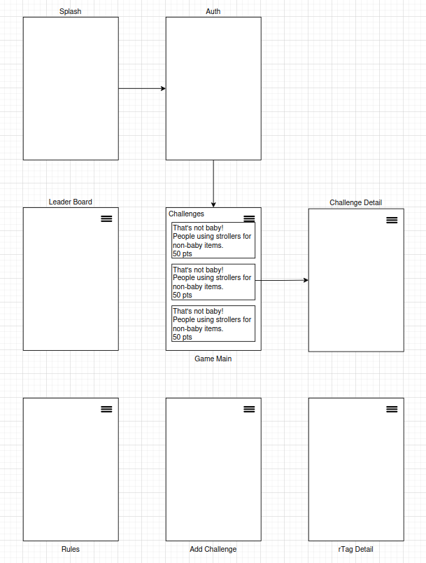

# rTag
Reverse Tagging Photo Challenges.

## Tech Stack
* API/Service Layer:
    * Java/OpenAPI
* Client App:
    * React:
        * React-Router
* Cloud Infratstructure - AWS (?)
* Database - DynamoDB (?)

## Service Layer
### Data Structure Summary
* GameSystem
    * currentVersion - string
* Season
    * seasonId - string
    * created - datetime
    * updated - datetime
    * status - enum
    * title - string
    * description - string
* Player
    * playerId - string
    * playerHash - string
    * created - datetime
    * updated - datetime
    * status - enum
    * handle - string
    * email - string
    * mobile - string
* rTag
    * rtagId - string
    * ownerId - string
    * seasonId - string
    * created - datetime
    * updated - datetime
    * status - enum
    * title - string
    * description - string
* Challenge
    * challengeId - string
    * ownerId - string
    * seasonId - string
    * created - datetime
    * updated - datetime
    * status - enum
* Entries
    * entryId - string
    * ownerId - string
    * seasonId - string
    * challengeId - string
    * status - enum
    * created - datetime
    * updated - datetime
* Vote
    * voteId - string
    * ownerId - string
    * objectId - string
    * vote - boolean
    * status - enum
    * created - datetime
    * updated - datetime

## UI Layer
